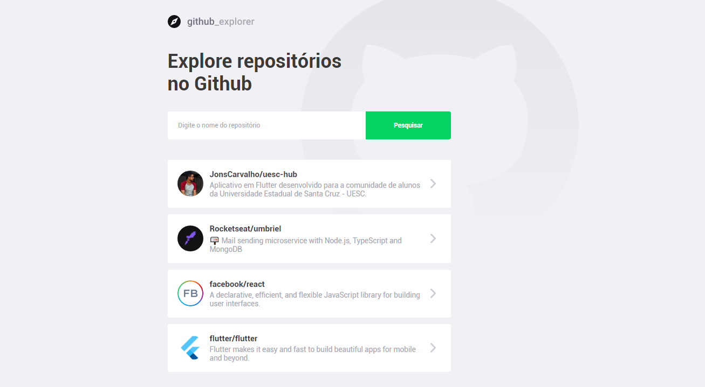
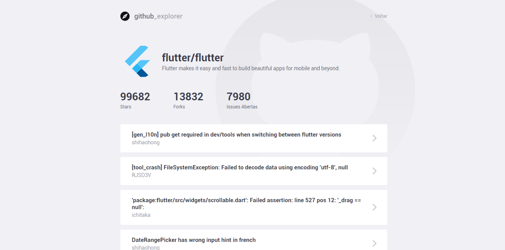

<h1 align="center">
    Github Explorer
</h1>

<h4 align="center">
  Project developed in ReactJS using TypeScript, it consists of an application that consumes the [Github api](https://api.github.com) to show information about repositories.
</h4>
<p align="center">

  

  

  

  

</p>

<p align="center">
  <a href="#rocket-technologies">Technologies</a>&nbsp;&nbsp;&nbsp;|&nbsp;&nbsp;&nbsp;
  <a href="#information_source-how-to-use">How To Use</a>&nbsp;&nbsp;&nbsp;|&nbsp;&nbsp;&nbsp;
  <a href="#memo-license">License</a>
  <a href="#aut-author">Author</a>
</p>


<p align="center">
  
</p>

<p align="center">
  
</p>


## :rocket: Technologies

-  [TypeScript](https://www.typescriptlang.org/)
-  [ReactJS](https://reactjs.org/)
-  [Axios](https://github.com/axios/axios)
-  [styled-components](https://www.styled-components.com/)
-  [VS Code][vc] with [EditorConfig][vceditconfig] and [ESLint][vceslint]

## :information_source: How To Use

To clone and run this application, you'll need [Git](https://git-scm.com) + [Yarn 7.8.3][yarn] or higher installed on your computer. From your command line:


```bash
# Clone this repository
$ git clone <https://github.com/JonsCarvalho/github-explorer>

# Go into the repository
$ cd github-explorer

# Install dependencies
$ yarn install

# Start Application
$ yarn start

```

## :memo: License
This project is under the MIT license. See the [LICENSE](https://github.com/JonsCarvalho/github-explorer/blob/master/LICENSE.md) for more information.

## :aut: Author

---

<a href="https://github.com/JonsCarvalho/">
 
 <br />
 <sub><b>Jônatas Carvalho</b></sub>
</a>

Made with ♥ by Jônatas Moreira de Carvalho :wave:
[](https://www.facebook.com/J.o.n.a.t.a.s.C.a.r.v.a.l.h.o.w/) [](https://www.instagram.com/jonscarvalho/) [](https://www.linkedin.com/in/jonscarvalho/) [](mailto:jonatascarvalhow@gmail.com)

[yarn]: https://yarnpkg.com/
[vc]: https://code.visualstudio.com/
[vceditconfig]: https://marketplace.visualstudio.com/items?itemName=EditorConfig.EditorConfig
[vceslint]: https://marketplace.visualstudio.com/items?itemName=dbaeumer.vscode-eslint
